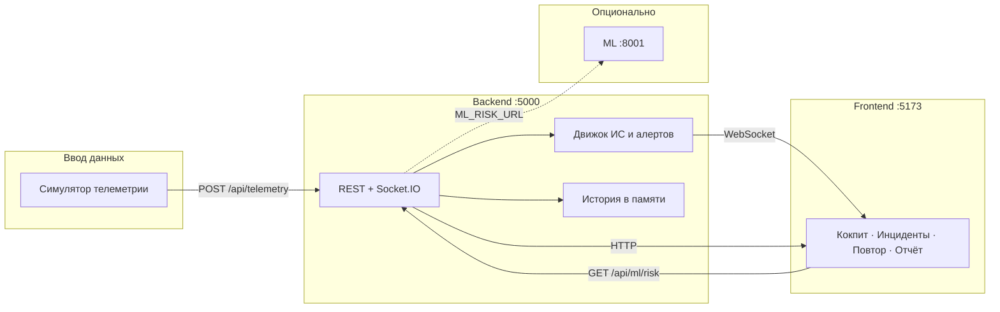

# KTZ · Цифровой двигатель локомотива

Монорепозиторий прототипа **операторского контура KTZ**: поток телеметрии → индекс состояния (ИС) → оповещения с рекомендациями → архив для повтора и отчётов.  
Интерфейс ориентирован на **диспетчерскую работу**; основной источник истины по здоровью — **правило-ориентированный движок** на бэкенде; дополнительный ML-риск и эвристики «интеллекта» — опциональны и не заменяют ИС.

**Стек:** Node.js 20 LTS (см. `.nvmrc`) · Express · Socket.IO · React (Vite) + Tailwind · Docker Compose · опционально Python (FastAPI) для ML.

---

## Содержание

- [Архитектура](#архитектура)
- [Требования](#требования)
- [Быстрый старт](#быстрый-старт)
- [Переменные окружения](#переменные-окружения)
- [Скрипты npm](#скрипты-npm-корень-репозитория)
- [Docker Compose](#docker-compose)
- [Профили локомотивов и сценарии](#профили-локомотивов-kz8a--te33a)
- [Демо-аккаунты и роли](#демо-аккаунты-и-роли)
- [API и документация](#api-и-документация)
- [Опциональный ML-сервис](#опциональный-ml-сервис-hk-021)
- [Тесты и CI](#тесты-и-ci)
- [Структура репозитория](#структура-репозитория)
- [Соглашения по Git](#соглашения-по-git)
- [Известные ограничения](#известные-ограничения)

---

## Архитектура



- **Симулятор** шлёт снимки телеметрии с заданным интервалом (по умолчанию ~1 Гц).
- **Бэкенд** считает ИС, оценивает алерты, отдаёт историю и отчёты; по WebSocket пушит обновления клиенту.
- **Фронтенд** SPA: лендинг, вход, кокпит, центр инцидентов, повтор, отчёт; у администратора — настройки весов/порогов.

---

## Требования

| Компонент | Версия |
|-----------|--------|
| Node.js | **18+** (в CI — **20**, см. `.nvmrc`) |
| npm | **9+** |
| Docker | опционально, для `docker compose` |
| Python 3 | только если нужны `npm run dev` с ML или отдельный `ml:serve` |

---

## Быстрый старт

```bash
git clone <url> ktz-swe
cd ktz-swe
npm install
```

Скопируйте при необходимости окружение (значения по умолчанию подходят для локальной разработки):

```bash
# Linux / macOS
cp .env.example .env

# Windows (PowerShell)
copy .env.example .env
```

Рекомендуемые команды:

| Цель | Команда |
|------|---------|
| Полный стек: API + UI + симулятор + **ML** (нужен Python и `pip install -r ml/requirements.txt`) | `npm run dev` |
| Без Python / ML | `npm run dev:no-ml` |
| Только API + UI (без симулятора) | `npm run dev:stack` |

### Куда смотреть в браузере

| URL | Назначение |
|-----|------------|
| http://localhost:5173 | Лендинг → вход → приложение |
| http://localhost:5173/cockpit | Кокпит (нужна сессия) |
| http://localhost:5000/health | Проверка живости API |
| http://localhost:5000/openapi.json | Спецификация OpenAPI 3 |
| http://localhost:5000/docs/ | Swagger UI (со слешем в конце) |

После запуска выровняйте **профиль в шапке приложения** (KZ8A / TE33A) с переменной **`LOCOMOTIVE_TYPE`** у симулятора — иначе возможно предупреждение о несовпадении потока и выбранного профиля.

---

## Переменные окружения

Канонический список — **корневой** `.env.example`. Кратко:

| Переменная | Назначение |
|------------|------------|
| `PORT` | Порт API (по умолчанию `5000`) |
| `CLIENT_URL` | Origin фронта для CORS Socket.IO (например `http://localhost:5173`) |
| `BACKEND_URL` | Куда симулятор шлёт телеметрию (`http://localhost:5000` локально; в Compose — `http://backend:5000`) |
| `SIM_INTERVAL_MS` | Интервал тиков симулятора (мс), по умолчанию `1000` |
| `LOCOMOTIVE_TYPE` | `KZ8A` или `TE33A` |
| `VITE_API_URL` / `VITE_WS_URL` | Базовые URL для REST и WebSocket во фронте (при сборке Docker подставляются build-args) |
| `VITE_DEMO_CONTROLS=true` | Показать селектор сценария и расширенные «демо»-элементы **не только** админу (хакатон / запись демо) |
| `ML_RISK_URL` | Базовый URL Python-сервиса риска (по умолчанию `http://127.0.0.1:8001`) |

Переменные с префиксом `VITE_` должны быть доступны на этапе **сборки** фронта (в т.ч. в Docker build).

---

## Скрипты npm (корень репозитория)

| Команда | Описание |
|---------|----------|
| `npm run dev` | Backend + frontend + simulator + ML (uvicorn, порт 8001) |
| `npm run dev:no-ml` | Backend + frontend + simulator |
| `npm run dev:stack` | Backend + frontend |
| `npm run build` | Production-сборка Vite → `apps/frontend/dist/` |
| `npm test` | Юнит-тесты бэкенда |
| `npm run ci` | `npm test` && `npm run build` |
| `npm run smoke:api` | HTTP-smoke: `/health`, OpenAPI, `/docs/` |
| `npm run ml:train` | Обучение модели риска из CSV |
| `npm run ml:serve` | Только ML API на порту 8001 |

---

## Docker Compose

Из корня:

```bash
docker compose up --build
```

| Сервис | Описание |
|--------|----------|
| `backend` | API + Socket.IO — порт **5000** на хосте |
| `frontend` | nginx + статическая сборка — **5173** |
| `simulator` | POST телеметрии на `http://backend:5000` внутри сети compose |

Контейнер **ML в compose не входит**; при необходимости ML поднимают на хосте (`ml:serve`) и задают `ML_RISK_URL`.

Для ежедневной разработки с hot reload удобнее `npm run dev` / `npm run dev:no-ml`, чем только Compose.

---

## Профили локомотивов (KZ8A / TE33A)

Единый каталог полей, порогов и весов подсистем: `apps/backend/src/profiles/index.js`.

| Профиль | Тип | Примечание |
|---------|-----|------------|
| **KZ8A** | Электровоз (25 кВ) | Акцент на контактной сети, тепле инверторов/ТД и т.д. |
| **TE33A** | Дизель-электрический | Подсистема «thermal» в движке отражает **силовую установку** (масло / ОЖ / ДВС); для правил используется согласованная агрегация температур |

Сценарии демо (симулятор и `POST /api/scenario`): например `normal`, `warning_overheat`, `critical`, `highload`, `brake_drop`, `signal_loss` — полный список в ответе `GET /api/scenario` (`valid`).

---

## Демо-аккаунты и роли

Встроенная **демо-авторизация** (сессия в `sessionStorage`, не для продакшена):

| Логин | Пароль | Роль |
|-------|--------|------|
| `operator` | `demo` | Кокпит, инциденты, повтор, отчёт |
| `admin` | `demo` | То же + **Настройки** (веса и пороги) |

Интерфейс по умолчанию **на русском**; обозначения типов **KZ8A**, **TE33A** и технические коды остаются латиницей.

---

## API и документация

| Метод | Путь | Назначение |
|--------|------|------------|
| GET | `/health` | Liveness |
| GET | `/openapi.json` | OpenAPI 3 |
| GET | `/docs/` | Swagger UI |
| GET | `/api/current` | Последний снимок + здоровье |
| GET | `/api/history` | История (`from`, `to`, `locomotiveType`, `locomotiveId`, `order=asc\|desc`, …) |
| GET | `/api/report` | Отчёт по окну — JSON или CSV (`format=json\|csv`) |
| GET | `/api/scenario` | Текущий сценарий и список допустимых |
| POST | `/api/telemetry` | Приём телеметрии |
| POST | `/api/scenario` | Смена сценария демо |
| GET/PATCH | `/api/settings` | Чтение и обновление настроек движка (админ) |
| GET | `/api/ml/risk` | Прокси к дополнительной оценке риска (если ML доступен) |

Для **графиков повтора** обычно нужен `order=asc` по времени.

---

## Опциональный ML-сервис (HK-021)

Каталог `ml/`: обучение на `artifacts/datasets/synthetic_dataset.csv`, выдача **дополнительного** индикатора риска. Основной ИС остаётся на бэкенде.

Кратко:

```bash
cd ml
python3 -m venv .venv
# Windows: .venv\Scripts\activate
source .venv/bin/activate
pip install -r requirements.txt
python train_risk_model.py
uvicorn serve:app --host 0.0.0.0 --port 8001
```

Подробнее: `ml/README.md`. Бэкенд ходит в ML по `ML_RISK_URL`.

---

## Тесты и CI

Локально (как в пайплайне):

```bash
npm test
npm run build
node scripts/ci-smoke-api.js
```

Если порт 5000 занят: `PORT=5059 node scripts/ci-smoke-api.js` (см. комментарии в скрипте).

В GitHub Actions на push/PR в `main` / `master`: установка зависимостей → тесты → сборка фронта → smoke API.

---

## Структура репозитория

```
.
├── apps/
│   ├── backend/       API Express, Socket.IO, движок ИС, алерты, отчёты
│   ├── frontend/      React, Vite, Tailwind, операторский UI
│   └── simulator/     Генератор телеметрии для разработки и демо
├── ml/                Обучение и FastAPI-сервис доп. риска
├── scripts/           ci-smoke-api.js и вспомогательные скрипты
├── artifacts/datasets/  Синтетические CSV для ML
├── docs/              Доп. материалы (например сценарий демо)
├── .env.example
├── docker-compose.yml
└── package.json       workspaces: apps/*, ml
```

---

## Соглашения по Git

- Ветки: `feature/HK-XXX-кратко`, `fix/HK-XXX-…`, `chore/HK-XXX-…`
- Коммиты: `feat|fix|chore|docs|test|refactor(HK-XXX): описание`
- Шаблоны: `.github/ISSUE_TEMPLATE/`, `.github/pull_request_template.md`

---

## Известные ограничения

- Персистентность в PostgreSQL **вне** объёма текущего прототипа; история и алерты — в памяти процесса с ограничением по окну времени.
- Демо-логины и сценарии — для стенда и презентаций, не модель продакшен-безопасности.

---

**KTZ Digital Twin** — внутренний прототип операционного контура; при вопросах по развёртыванию ориентируйтесь на `.env.example` и логи сервисов `backend` / `simulator`.
